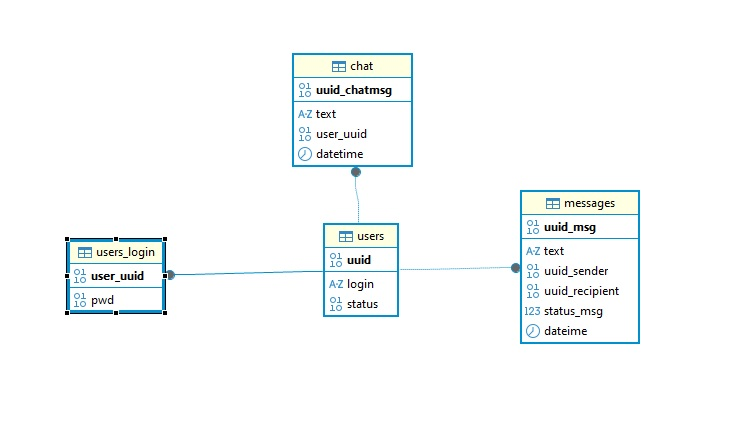

# Chat_QT
Итоговый проект SF

Проект реализован в QT6, база данных на MySQL, сетевое TCP (QTCPServer, QTCPSocket) взаимодействие через requestHandler() посредством QJsonObject и QDataStream. 
Клиент взаимодействует с сервером, сервер взаимодействует с клиентом и базой данных. Хэш паролей в SHA256. 
В базе данных пользователи, сообщения общие и приватные получают уникальный uuid(v7). Для снижения нагрузки на базу данных и ускорения поиска поля uuid, hash sha256, status в BINARY.
Для безопасности hash паролей вынесен в отдельную таблицу со ссылкой на первичный ключ uuid пользователя.

 

Status пользователя: 
0x01 - статус для нового пользователя
0x02 - пользователь заблокирован
0x28 - Admin
